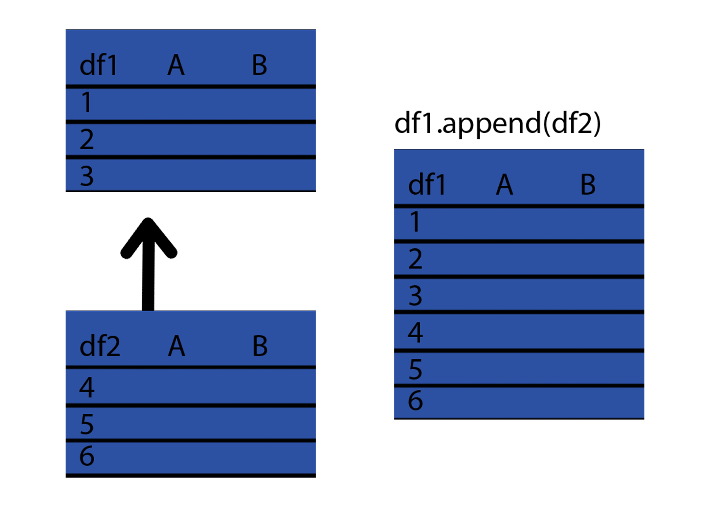
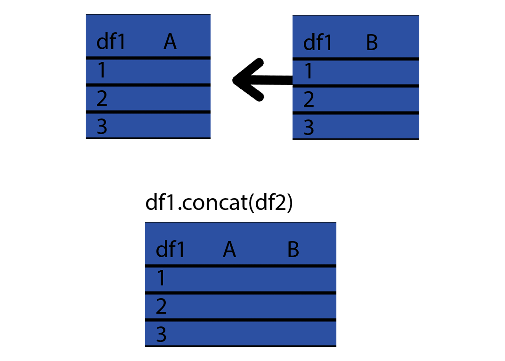
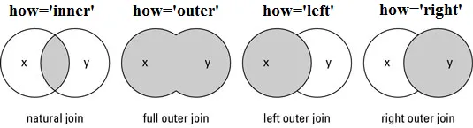

### Aj Averett

---

### Table of Contents
- [Importing Data](#importing-data)
    + [Pandas functions to import  data](#pandas-functions-to-import--data)
- [Inspecting Data](#inspecting-data)
    + [Pandas functions to inspect data](#pandas-functions-to-inspect-data)
- [Calculating Data](#calculating-data)
    + [Pandas functions to do statistical calculations with data](#pandas-functions-to-do-statistical-calculations-with-data)
- [Selecting Data](#selecting-data)
    + [Pandas functions to select data](#pandas-functions-to-select-data)
    + [Pandas functions to locate data with loc and iloc](#pandas-functions-to-locate-data-with-loc-and-iloc)
- [Cleaning Data](#cleaning-data)
    + [Pandas functions to clean columns](#pandas-functions-to-clean-columns)
    + [Pandas functions to clean row values](#pandas-functions-to-clean-row-values)
    + [Pandas functions to clean NaN values](#pandas-functions-to-clean-nan-values)
- [Manipulating Data](#manipulating-data)
    + [Pandas functions to select columns from an expression](#pandas-functions-to-select-columns-from-an-expression)
    + [Pandas functions to select aggregated columns](#pandas-functions-to-select-aggregated-columns)
- [Combining Data](#combining-data)
    + [Pandas functions to combine dataframes vertically and horizontally](#pandas-functions-to-combine-dataframes-vertically-and-horizontally)
    + [Pandas functions to merge dataframes on a key](#pandas-functions-to-merge-dataframes-on-a-key)

---

# Importing Data 
### Pandas functions to import  data
<br>

__Read CSV file__ `df = pd.read_csv('data.csv')`

* Assigns data.csv to a dataframe called 'df'.


_Additional Arguments_

>>__Specify header__
>>
>>* The code below will assume the csv file has no column names (only data) thus _'df'_ column names will be numbers
>>`df = pd.read_csv('data.csv', header=None)`
>><br>
>>
>>* The code below will assume the first two lines in the CSV file are headers.
>>`df = pd.read_csv('data.csv', header=[0,1])`
>>
>>__Skip rows__
>>* The code below will ignore the first two rows in the CSV >>file.
>>`pd.read_csv('data.csv', skiprows=2, header=None)`
>>
>>__Encoding__
>>* The code below will read the csv file in the [encoding]>>(https://docs.python.org/3/library/codecs.html#standard-encodings) specified.
>>`pd.read_csv('data.csv', encoding ='utf-8')`
>>
>>__Encoding Errors__
>>* The code below will ignore any special characters it doesn't recognize. 
>>`pd.read_csv('data.csv', encoding_errors ='ignore')`

<br>

__Read CSV from a website__
```
url = 'https://raw.githubusercontent.com/davendano99/Line-Chart-Practice/main/data.csv.csv'

dat_temp = pd.read_csv(url)
```

---

# Inspecting Data

### Pandas functions to inspect data
<br>

__Columns__ `df.columns`

* Displays the column labels of the DataFrame.

__Shape__ `df.shape`

* Displays the length and width of the DataFrame.

__Heads and Tails__ `df.head(n)` `df.tails(n)`
* Displays the first _n_ rows of df
* Displays the last _n_ rows of df


__Describe__ `df.describe()`

* Gives the count, mean, std, min, 25%, 50%, 75%, and max of each column in _df_

__Value Counts__ `df['column_one'].value_counts()`
* Gives the count of each unique value in _column_one_.

_Additional Arguments_
>>
>>__Ascending__
>>* The code below will give the number of unique values in ascending order.
>>`df['column_one'].value_counts(ascending=True)`
>>
>>__Normalize__
>>
>>* The code below will give the number of unique values in percentages rather than raw count.
>>`df['column_one'].value_counts(normalize=True)`
<br>

__Continuous Data__

* The code below will give value counts for continuous data. Below, n is for how many bins pandas will auto-generate.
`df['column_one'].value_counts(bin = n)`

__Counting NaNs__

* The code below will include NaNs in the number of unique values returned.
`df['your_column'].value_counts(dropna=False)`

More tricks [here](https://re-thought.com/pandas-value_counts/)
</details>

---

# Calculating Data

### Pandas functions to do statistical calculations with data

These are basic calculations that can be used in various function.

`df['Income'].mean()`  Gives the average income.
`df.count() ` Gives the number of non-null values in each column
`df.max() ` Gives the highest value in each column
`df.min() ` Gives the lowest value in each column
`df.median() ` Gives the median of each column
`df['Income'].std() ` Gives the standard deviation of the income column

---

# Selecting Data


### Pandas functions to select data 

<br>

__Show dataframe__ `df`

*  Displays the entire DataFrame.

__Show column(s)__ `df['column_one']`

* Displays the _column_one_ from _df_.

_Additional Arguments_
>>__Multiple columns__
>>* The code below will display both _column_one_ and _column_two_.
>>`df[['column_one','column_two']]`
>>
<br>

### Pandas functions to locate data with loc and iloc

<br>

The _loc[ ]_ command takes two arguments: one specifying the rows, and one specifying the columns. These arguments are separated by a comma. Finally, if ":" is passed alone as an argument, this will return all the data.

__Locating data with loc[]__:
*  `df.loc[:,:]` will return all the rows and columns 

* `df.loc[1,:]` will return row 1 with all the columns
* `df.loc[[1,6],:]` will return row 1 and 6 with all the columns
* `df.loc[[1:6],:]` will return row 1 through 6 with all the columns

* `df.loc[:,['column_one']]` will return all values under column_one
* `df.loc[:,['column_one','column_three']]` will return all values under column_one and column_three
* `df.loc[:,'column_one':'column_three']` will return all values under column_one through column_three

<br>

___Note 1:__ The above code assumes that the row index names are numbers. If the index row names were letters, `df.loc['A',:]` would display row _A_._

___Note 2:__ loc[] can be used with just one argument. Pandas assumes you are only sifting through rows and will by default display all column values respective to the rows._

___Note 3:__ loc[] is very similar to `df.filter(items = x)`. For example:_
`df.filter(items=['First Name', 'Last Name'])` and 
`df.filter(items=[1,2,3], axis = 0)` are similar to 

`df.loc[:,['First Name','Last Name']]` and
`df.loc[[1,2,3],:]` respectively.
<br>


__Filtering data with loc[]__
* `df.loc[df['gender']=='Male']` will return all data where gender is male
* `df.loc[df['race'].isin(['Black','Asian'])]` will return all data where race is either Black or Asian.
* `df.loc[(df['race'] != "White") & (df['sex'] == "Female")]` will return all Females who are not White.
* `df.loc[df['gender'].notnull() == True]` Since there may be null values in some columns, the code here will return all data where gender is known (not a null value).


<summary> Pandas functions to locate data with iloc[ ] </summary>

<br>

The _iloc[ ]_ command takes two arguments: one specifying the rows, and one specifying the columns. These arguments are separated by a comma. Finally, if ":" is passed alone as an argument, this will return all the data.

__Locating data with iloc[]__:
* `df.iloc[:,:]` will return all the rows and columns 

* `df.iloc[1,:]` will return row 1 with all the columns
* `df.iloc[[1,6],:]` will return row 1 and 6 with all the columns
* `df.iloc[[1:6],:]` will return row 1 through 6 with all the columns

* `df.iloc[:,1]` will return all values under the first column (0 would be the index)
* `df.iloc[:,[1,3]]` will return all values for column 1 and 3
* `df.iloc[:,1:3]` will return all values under column 1 through 3

<br>

___Note 1:__ The above code will only take integers since iloc is an index based function._

___Note 2:__ loc[] can be used with just one argument. Pandas assumes you are only sifting through rows and will by default display all column values respective to the rows._

<br>

---

# Cleaning Data

### Pandas functions to clean columns 

<br>

__Set index to a column__ `df.set_index('column_one')`
* Sets index to _column_one_.

__Rename Column(s)__ `df.rename(columns={"column_one": "col1"})`
* Renames _column_one_ to _col1_.

__Drop Column(s)__ `df.drop(columns=['B', 'C'])`
* Drops the respective column(s)

__Change Column(s) Datatype__ `df.astype({"Race":'category', "Age":'int64'})`
* Changes the _Race_ column to a categorical data type, changes _Age_ column to an integer data type.

___Note:__ In order to format these functions to multiple columns at once, the dictionary method as seen in the code below is an elegant way of performing this._
```
    dat.rename(columns = {
        'column_one':'col1',
        'column_two':'col2',
        'column_three':'col3
        })
```

### Pandas functions to clean row values 

__Replace values__ `df = df.replace('M', 'Male')`
* Replaces all instances of _M_ to _Male_ in rows.

_Additional Arguments_

>>* `df['Gender'] = df['Gender'].replace('M', 'Male')` Replaces all instances of _M_ to _Male_ in the Gender column.
>>
>>* `df['Age'] = df['Age'].replace('0',np.nan)` Replaces all instances of a _0_ age with a NaN value.
>>
### Pandas functions to clean NaN values 

__Drop NA__ `df.dropna()`
* Drops all rows that contain null values

_Additional Arguments_
>>* `df.dropna(axis=1)` drops all columns that contain null values
>>* `df.dropna(thresh=n)` drops all rows that have less than n non null values
>>* `df.dropna(subset=['name', 'address'])` drops all rows where there are null values in the name and address columns.
>>
<br>

__Fill NA__ `df.fillna(x)`
* Replace all null values with x

_Additional Arguments_
>>
>>* `df['Country'].fillna(method = ffill)` fills NA value with the value above the NA value.
>>
>>* `df['Country'].fillna(method = bfill)` fills NA value with the value below the NA value.
>>
>>* `df['Income'].fillna(df['Income'].mean())` drops all rows have have less than n non null values
>>
<br>

---

# Manipulating Data

### Pandas functions to select columns from an expression

__Query__

`df.query("Income >= 12000")`
This code will display all rows with an income greater or equal to 12,000.

`df.query("Region == 'East'")`
This code will display all rows with the region being East.

`df.query("not (Race == 'White' and Gender == 'Male')")`
This code will display all rows with the race and gender being not White and Male.

__Sort Values__

`df.sort_values('Income')`
This code will sort values by Income in ascending order

`df.sort_values('Income', ascending=False)` 
This code will sort values by Income in descending order

`df.sort_values(['Income','Name'],ascending=[True,False])` 
This code will sort values by Income in ascending order and then sort names in alphabetical order

___Note__: All numerical data is automatically sorted from least to greatest while string values are automatically sorted alphabetically._

### Pandas functions to select aggregated columns

__Group By__

Assume the columns: Gender, Num_Gadgets_made, Income

__Group By with Sum__ `df.groupby('Gender').sum()`
This code will group _df_ by gender using the sum of the column data. This may be useful to compare the raw total of Num_Gadgets_made by gender.


__Group By with Count__ `df.groupby('Gender').count()`
This code will group _df_ by gender using the count of the column data. This may be useful for seeing the total number of people by gender.

__Group By with Mean__ `df.groupby('Gender').mean()`
This code will group _df_ by gender using the mean of the column data. This may be useful to compare the average Income by gender.


__Pivot Table__
Assume a table with the columns: Region, gadget_type, and Units. 


|    | Region   | gadget_type   |   Units |
|---:|:---------|:--------------|--------:|
|  0 | North    | radok         |      10 |
|  1 | South    | osmit         |      12 |
|  2 | East     | radok         |      14 |
|  3 | West     | radok         |      16 |
|  4 | North    | osmit         |      18 |
|  5 | South    | radok         |      20 |
|  6 | East     | osmit         |      22 |
|  7 | West     | osmit         |      24 |
|  8 | South    | radok         |      26 |
|  9 | East     | osmit         |      28 |
| 10 | West     | osmit         |      30 |
| 11 | North    | osmit         |      32 |


<br>
This table can be aggregated in a way similar to the groupby function above. The largest difference between these two functions is that pivot_table utilizes the columns for the aggregation.

<br>
<br>

__Seeing the count for the gadget_type for each region__

```
dat.pivot_table(
    index = 'Region', 
    columns = 'gadget_type',
    aggfunc = 'size')
```

| Region   |   osmit |   radok |
|:---------|--------:|--------:|
| East     |       2 |       1 |
| North    |       2 |       1 |
| South    |       1 |       2 |
| West     |       2 |       1 |

_This, for example, shows there are 2 rows that have osmit and East._

<br>

__Seeing the mean for the gadget_type for each region__

```
dat.pivot_table(
    index = 'Region', 
    columns = 'gadget_type',
    aggfunc = 'mean')
```


| Region   |   ('Units', 'osmit') |   ('Units', 'radok') |
|:---------|---------------------:|---------------------:|
| East     |                   25 |                   14 |
| North    |                   25 |                   10 |
| South    |                   12 |                   23 |
| West     |                   27 |                   16 |

_This, for example, shows that the average for all units of osmits in the East is 25._

---

# Combining Data

### Pandas functions to combine dataframes vertically and horizontally

<br>

__Append__ `df1.append(df2)`

Add the rows in df1 to the end of df2 (columns should be identical)



<br>
<br>
<br>

__Concat__ `pd.concat([df1, df2],axis=1)`

Add the columns in df1 to the end of df2 (rows should be identical)



<br>
<br>

### Pandas functions to merge dataframes on a key



<br>
<br>

___Note__: There are multiple ways to merge dataframes. The key column is based on a designated column. If two dataframes have a key column that are of the same type, these dataframes can be merged together. For the code below, the key column is determined by the "on" parameter and the method of the merge is determined by the "how" parameter._

__Inner Join__ `df1.merge(df2, on='ID')`
The code above will merge both df1 and df2 together when both dataframes share the same key values.

__Left Join__ `df1.merge(df2, how='left', on='ID')`
The code above will merge both df1 and df2 together based on the key values of df1.

__Full Join__ `df1.merge(df2, how='full', on='ID')`
The code above will merge both df1 and df2 together using both all key values.


---


